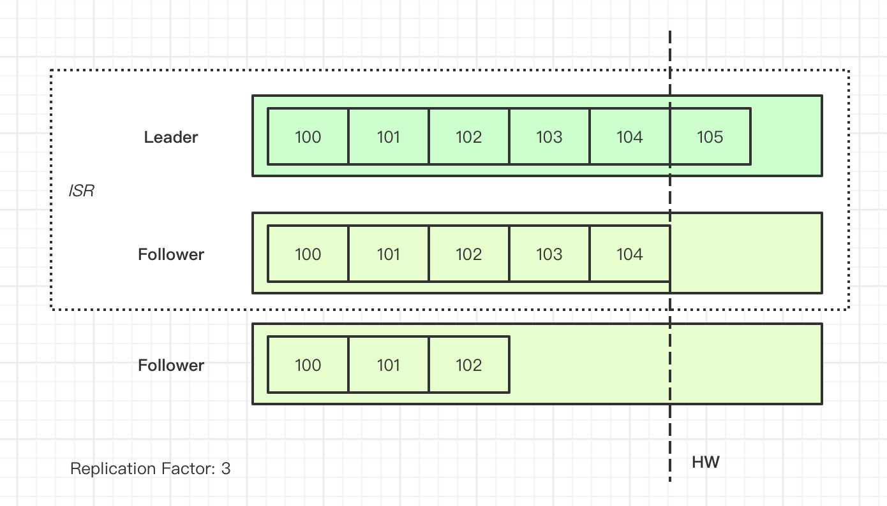

Kafka 的数据可靠性完全依赖于复制（Replication）而不依赖于单机的 fsync。简单整理起来，Kafka Replication 大致上是这样的设计：

Partition 是复制的基本单位，每个 Partition 有多个 Replica，其中的一个 Replica 是 Leader， Leader 负责着与 Consumer 之间的所有读写交互，而 Follower 从 Leader 中通过 Fetch RPC 去拉取同步。default.replication.factor 参数决定着一个 Topic 下的 Partition 含有多少个 Replica。

Leader 维护着一组 ISR （In-Sync-Replica）列表，表示认为处于正常同步状态的 Follower 集合。Kafka 依据 replica.lag.time.max.ms 参数来判定一个 Replica 是否仍属于 ISR，如果 Follower 较长时间未与 Leader 保持同步，则 Leader 会考虑将这个 Follower 从 ISR 中踢走。

除非设置 unclean.leader.election.enable，则新的 Leader 总是从 ISR 中选举得出。min.insync.replicas 决定着每个 topic 能接受的最少 ISR 个数，如果存活 ISR 个数太少，生产消息侧会报异常。

Producer 可以配置 request.required.acks 来决定消息的持久性程度，0 可以认为是 Fire and Forget，1 是收到 Leader 的 ack，而 all 是收到所有 ISR 的 ack。

一旦 Producer 生产的消息同步给了所有 ISR，便可以将这条消息的下标设置为 HW（High Watermark），小于 HW 下标的消息视为 "Committed"。消费者只能看到大于 HW 的消息。

简单画个图：



ISR 和 HW 的设计是 MySQL 这类异步复制、半同步复制所没有的，那么，为什么需要引进 ISR 和 HW 机制呢？

## HW

“高水位” 是流式处理系统中常见的名次，含义大约是已存在的数据，但是对读者不可见。对 Kafka Consumer 来讲，有这么几个偏移量：


消费者 Fetch 到的数据可能到 LEO 为止，但只会向用户返回 HW 之前的数据。这里 HW 的意义就在于，能保障用户读到的数据都是持久化到所有 ISR 的，即使 Leader 宕机切换，仍能保障用户读到过的同一下标的消息不会发生改变。*对消息队列这一场景而言，宁愿丢失消息，也不希望消费过的消息在重复消费时发生变化*，如果重复消费同一下标的消息发生了变，消息的单调顺序性对外部系统就不成立了，这意味着数据损坏。

## ISR
猜测 ISR 的设计很大程度上是出于吞吐性能方面的考虑。设想一下，如果 acks = all 的行为是将消息同步给所有 Follower 做全同步，那么如果一个 Follower 发生了重启，便会导致所有的写入都被阻塞掉，而阻塞的时间取决于重启的时间，这台主机也有可能永远回不来。

ISR 机制很优雅地解决了这个问题：Leader 持续地对 Follower 做同步性检查，如果 Follower 并不能保持同步状态，那么该 Follower 会被移出 ISR，不会再阻塞写入。

过去 Kafka 通过 replica.lag.max.messages 参数来判定 ISR 的同步性，通过 Follower 的 Fetch 请求携带的下标，判定 Follower 与 Leader 的同步差异。然而如《 [Hands-free Kafka Replication: A lesson in operational simplicity ](https://www.confluent.io/blog/hands-free-kafka-replication-a-lesson-in-operational-simplicity/)》 这篇文章所说，通过消息数的差值做同步性判定很容易发生误判：一个 topic 的吞吐量如果突然增加，消息差值增大是合理的，但这不意味着该 Follower 出于非同步状态。在后续的版本改为了统一按 replica.lag.time.max.ms 参数指定的 lag 时间来做同步性判定。

## 怎样做到不丢消息？
DBMS 中持久性的定义是，保障写入成功的数据永不丢失，但是在写入时报错并不影响系统的持久性。消息系统这点与 DBMS 不同，做数据管道时，写入时报错也意味着数据的丢失。那么怎样保障消息的不丢失？

Kafka Producer 会在客户端将消息暂存到 buffer 中，如果不能接受数据丢失，当 buffer 满时阻塞等待要比报错更可取。如果不接受丢失，无限重试是好理解的，不过这里有一个细节是如果 Producer 到 broker 存在多个并发的请求，那么重试将导致丢失消息的顺序，因此如果在意消息的顺序性，也应注意限制并发请求的个数为 1。

按 Kafka 的语义，Consumer 通过 Auto Commit 可做到 At Most Once。如果期望 At Least Once，那么 Consumer 侧应在确定业务处理完成之后，手工执行 Commit Offset。如果不期望丢失，那么应该选择手工执行 Commit 实现 At Least Once 语义。

整理下 “不丢消息” 的相关配置：

```
# producer
acks = all
block.on.buffer.full = true
retries = MAX_INT
max.inflight.requests.per.connection = 1

# consumer
auto.offset.commit = false

# broker
replication.factor >= 3
min.insync.replicas = 2
unclean.leader.election = false
```

为了 “不丢消息”，会更多地选择阻塞行为而非 Fail Fast 行为，对 canal 这种数据管道场景是最合适的。然而同样的配置在在线业务系统里反而是比较危险的，阻塞行为有可能卡死业务进程，这里面需要做一些 Trade Off，至少需要注意一下  max.block.ms 是不是默认的 60s。工程上也有一些使用本地的持久性 KV Store 来暂存数据从而避免 Producer 发送端产生阻塞的做法，赌两个异构的组件不在同一时间挂。

## References
* https://www.cnblogs.com/huxi2b/p/7453543.html
* [Kafka Reliability - When it absolutely, positively has to be there](https://www.slideshare.net/gwenshap/kafka-reliability-when-it-absolutely-positively-has-to-be-there)
* [Hands-free Kafka Replication: A lesson in operational simplicity - Confluent](https://www.confluent.io/blog/hands-free-kafka-replication-a-lesson-in-operational-simplicity/)
* https://docs.confluent.io/current/installation/configuration/producer-configs.html
* https://www.cloudkarafka.com/blog/2019-09-28-what-does-in-sync-in-apache-kafka-really-mean.html

